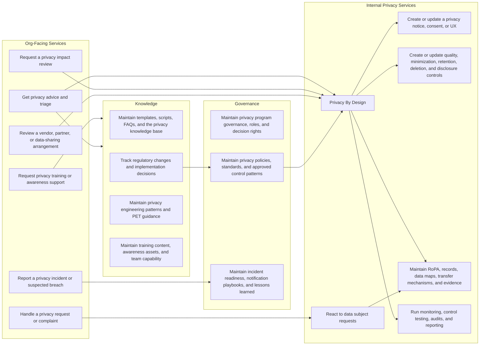

# Privacy Services

    
## Org-Facing Services

These are the entry-point services that business, product, engineering, HR, procurement, security, support, and operations teams are most likely to request directly.

### Get privacy advice and triage

- Description: Front-door intake for privacy questions, early guidance, and routing when a requester knows something is privacy-relevant but does not yet know which service should handle it.
- When to use:
  - A team is starting a new initiative and wants privacy involved early.
  - A requester is unsure whether the issue belongs in review, notice, rights, incident, vendor, or records work.
  - A change touches personal data and needs initial scoping before deeper privacy work begins.
- When not to use:
  - The matter is already clearly a live incident, data subject request, vendor review, or other specific service.
  - No personal data or privacy question is involved.
- Inputs:
  - `[placeholder: intake channel, requester details, business context, summary of the question or change]`
- Outputs:
  - `[placeholder: triage decision, assigned service, initial guidance, next actions]`
- Relevant models:
  - `Party`
  - `BusinessUnit`
  - `PrivacyProgram`
  - `ProcessingActivity`
  - `Assessment`
  - `ThirdPartyEngagement`
  - `Incident`
  - `DataSubjectRequest`

### Request privacy training or awareness support

- Description: Delivers privacy training, awareness sessions, issue-driven briefings, and audience-specific learning support.
- When to use:
  - A team needs onboarding, refresher training, or role-based privacy guidance.
  - A new process, control, or incident theme needs targeted awareness support.
  - A business area wants reusable privacy learning content or a live training session.
- When not to use:
  - The need is a case review or project assessment rather than training.
  - Existing material is sufficient and no new support is needed.
- Inputs:
  - `[placeholder: audience, objective, delivery format, topic, timing]`
- Outputs:
  - `[placeholder: training plan, session materials, attendance or assignment records, follow-up actions]`
- Relevant models:
  - `TrainingProgram`
  - `TrainingAssignment`
  - `Party`
  - `Evidence`

### Request a privacy impact review

- Description: Runs a structured privacy review for a new or changed initiative to identify privacy risks, findings, mitigations, and evidence needs.
- When to use:
  - A product, feature, workflow, or dataset change needs formal privacy assessment.
  - The processing is novel, high-impact, hard to explain, or likely to affect individuals materially.
  - A team needs documented risk decisions before launch or rollout.
- When not to use:
  - The work is only a minor records update with no material change in risk.
  - A live incident needs immediate containment and response first.
- Inputs:
  - `[placeholder: change summary, processing details, systems, parties, jurisdictions, timelines]`
- Outputs:
  - `[placeholder: assessment record, findings, risk ratings, mitigation actions, approval or escalation path]`
- Relevant models:
  - `Assessment`
  - `AssessmentFinding`
  - `PrivacyRisk`
  - `MitigationAction`
  - `Control`
  - `Evidence`
  - `ProcessingActivity`
  - `SystemAsset`

### Review a vendor, partner, or data-sharing arrangement

- Description: Reviews an external relationship or disclosure arrangement, linking the counterparty, role, flows, transfer mechanism, and due diligence expectations.
- When to use:
  - Procurement or a business owner wants to onboard, renew, or materially change a vendor or partner.
  - Personal data will be disclosed externally or accessed by another party.
  - Cross-border transfer or contractual role questions need privacy review.
- When not to use:
  - No external party or disclosure is involved.
  - The main issue is a live third-party incident rather than pre-existing due diligence or review.
- Inputs:
  - Counterparty identity, role, and business purpose for the arrangement.
  - Description of the services provided or the data-sharing use case.
  - Files and/or links to documentation.
- Outputs:
  - Review outcome.
  - Required contract terms, controls, or remediation conditions.
- Relevant models:
  - `ThirdPartyEngagement`
  - `Party`
  - `DataFlow`
  - `TransferMechanism`
  - `Assessment`
  - `Evidence`
  - `ProcessingActivity`
  - `Control`
  - `PrivacyRisk`
  - `LegalRequirement`
  - `OrganizationRequirement`

### Handle a privacy request or complaint

- Description: Manages intake and coordination for formal privacy requests or complaints received from individuals or external parties.
- When to use:
  - A team receives an access, deletion, correction, portability, objection, restriction, or similar request.
  - An individual raises a complaint about privacy practices, notices, or use of data.
  - A case needs assignment, deadline tracking, and documented response handling.
- When not to use:
  - The need is to design a general notice or preference experience rather than handle a live case.
  - The issue is a live incident that needs breach response.
- Inputs:
  - `[placeholder: request or complaint details, requester identity data, jurisdiction, deadlines, linked processing]`
- Outputs:
  - `[placeholder: logged case, assigned owner, response package, closure evidence, escalation or remediation actions]`
- Relevant models:
  - `DataSubjectRequest`
  - `Complaint`
  - `ProcessingActivity`
  - `Party`
  - `Evidence`
  - `Notice`
  - `PreferenceRecord`

### Report a privacy incident or suspected breach

- Description: Opens and manages a privacy incident record so the team can investigate, contain, assess harm, and make notification decisions.
- When to use:
  - Personal data may have been exposed, lost, misdirected, altered, or improperly accessed.
  - A suspected privacy event needs investigation even if facts are still incomplete.
  - A third party, system, or team reports a privacy-relevant security or handling issue.
- When not to use:
  - The need is preventive design review before launch.
  - The issue is only a policy question with no live or suspected event.
- Inputs:
  - `[placeholder: incident summary, discovery time, affected systems or parties, known facts, containment status]`
- Outputs:
  - `[placeholder: incident record, investigation status, notification decision, lessons learned, closure evidence]`
- Relevant models:
  - `Incident`
  - `BreachNotification`
  - `ProcessingActivity`
  - `ThirdPartyEngagement`
  - `SystemAsset`
  - `Evidence`
  - `Party`

## Internal Privacy Services

These are specialist privacy-team services that support execution, design, assurance, and operational recordkeeping behind the front-door requests.

### Privacy By Design

- Description: Embeds privacy review into delivery work by turning intake and assessment signals into design decisions, risk treatment, and implementation follow-through.
- When to use:
  - A project needs privacy input during design, build, or change management.
  - Privacy risks or issues need to be translated into concrete design or control decisions.
  - Inputs from intake, impact review, vendor review, policy, or monitoring need coordinated treatment.
- When not to use:
  - The task is only to maintain shared knowledge or governance artifacts with no active design work.
  - The work is purely operational execution of a live data subject request.
- Inputs:
  - `[placeholder: intake outcome, assessment inputs, system context, requirements, identified risks]`
- Outputs:
  - `[placeholder: design decisions, risk treatment plan, linked downstream work, implementation guidance]`
- Relevant models:
  - `Assessment`
  - `AssessmentFinding`
  - `PrivacyRisk`
  - `MitigationAction`
  - `Control`
  - `Evidence`
  - `ProcessingActivity`
  - `SystemAsset`
  - `Metric`

### Create or update a privacy notice, consent, or UX

- Description: Designs or updates the notice and choice experience around a processing activity, including collection-point messaging, consent states, and related user journeys.
- When to use:
  - A team is changing collection flows, consent banners, forms, scripts, or preference controls.
  - New or changed processing needs updated notice language or user-facing privacy UX.
  - A legal basis or transparency requirement needs implementation in product or operational touchpoints.
- When not to use:
  - The task is to execute a specific rights request already in progress.
  - No user-facing notice, preference, or consent element is changing.
- Inputs:
  - `[placeholder: processing details, user journey, legal basis, channel, draft copy, design constraints]`
- Outputs:
  - `[placeholder: approved notice content, consent or preference design, implementation guidance, evidence]`
- Relevant models:
  - `Notice`
  - `PreferenceRecord`
  - `LegalBasis`
  - `ProcessingActivity`
  - `LegalRequirement`
  - `Evidence`

### Create or update quality, minimization, retention, deletion, and disclosure controls

- Description: Designs or updates the lifecycle controls that govern how personal data is collected, limited, retained, corrected, disclosed, and deleted.
- When to use:
  - A team needs minimization or quality guardrails for a data flow, system, or process.
  - Retention, deletion, disclosure, or disclosure-approval controls need to be defined or changed.
  - An assessment or policy requirement results in control design or remediation work.
- When not to use:
  - The need is only to register a processing activity with no control-design question.
  - The issue is a live request or complaint already being executed operationally.
- Inputs:
  - `[placeholder: control objective, processing context, data categories or elements, systems, policy drivers]`
- Outputs:
  - `[placeholder: control design, retention or deletion rules, disclosure requirements, implementation tasks, evidence]`
- Relevant models:
  - `Control`
  - `RetentionRule`
  - `ProcessingActivity`
  - `ProcessingPurpose`
  - `DataCategory`
  - `DataElement`
  - `DataFlow`
  - `TransferMechanism`
  - `SystemAsset`
  - `Evidence`

### Maintain RoPA, records, data maps, transfer mechanisms, and evidence

- Description: Keeps records of processing, supporting data maps, transfer records, and accountability evidence current, searchable, and audit-ready.
- When to use:
  - The team needs to create or refresh a RoPA entry or supporting documentation.
  - Data maps, system records, or transfer mechanisms need to be updated after a change.
  - Evidence and traceability need to be aligned with current operations.
- When not to use:
  - The task is a new front-door review that has not yet been scoped.
  - A live incident or request needs immediate operational handling first.
- Inputs:
  - `[placeholder: processing record changes, systems, parties, flows, transfer details, supporting artifacts]`
- Outputs:
  - `[placeholder: updated records, current data maps, linked transfer mechanism records, evidence set]`
- Relevant models:
  - `ProcessingActivity`
  - `ProcessingPartyRole`
  - `DataFlow`
  - `TransferMechanism`
  - `SystemAsset`
  - `ThirdPartyEngagement`
  - `Evidence`

### React to data subject requests

- Description: Executes the privacy team's operational response to a data subject request after intake, including validation, retrieval, fulfilment, and documentation.
- When to use:
  - A rights request has been accepted and needs operational handling.
  - Systems, records, and evidence must be checked to fulfil a request accurately.
  - Preference, deletion, access, or correction actions need coordinated execution.
- When not to use:
  - The case is still only at initial intake or complaint triage.
  - The task is a general design change to notices or preferences rather than a live request.
- Inputs:
  - `[placeholder: accepted request, identity verification result, scope, deadlines, linked systems or processing records]`
- Outputs:
  - `[placeholder: fulfilment actions, response package, updated records, closure evidence]`
- Relevant models:
  - `DataSubjectRequest`
  - `ProcessingActivity`
  - `Party`
  - `PreferenceRecord`
  - `DataFlow`
  - `SystemAsset`
  - `Notice`
  - `Evidence`

### Run monitoring, control testing, audits, and reporting

- Description: Tests whether privacy controls operate as intended, records findings and risks, drives remediation, and produces assurance reporting.
- When to use:
  - The privacy team is running periodic monitoring, testing, or audit work.
  - Leadership, auditors, or regulators need metrics, findings, or assurance evidence.
  - Control performance and remediation status need structured reporting.
- When not to use:
  - The need is one-time intake or project scoping before design work starts.
  - The task is only to maintain knowledge content or training assets.
- Inputs:
  - `[placeholder: testing scope, control inventory, evidence sources, review cadence, reporting audience]`
- Outputs:
  - `[placeholder: test results, findings, risk updates, remediation tracking, metrics, reports]`
- Relevant models:
  - `Control`
  - `Assessment`
  - `AssessmentFinding`
  - `PrivacyRisk`
  - `MitigationAction`
  - `Evidence`
  - `Metric`
  - `Policy`

## Governance

These services maintain the privacy operating model, reusable control framework, and response readiness that support the rest of the catalogue.

### Maintain privacy program governance, roles, and decision rights

- Description: Keeps the privacy operating model current, including accountability, ownership, forums, escalation paths, and decision rights.
- When to use:
  - The privacy team is updating governance forums, ownership, or escalation routes.
  - Changes in structure, accountability, or operating model need to be documented.
  - Leadership reporting or program oversight needs refresh.
- When not to use:
  - A stakeholder needs a project-specific review rather than governance maintenance.
  - The issue can be resolved inside an existing service workflow without changing program structure.
- Inputs:
  - `[placeholder: operating model changes, role updates, governance decisions, reporting requirements]`
- Outputs:
  - `[placeholder: updated governance records, role definitions, decision-rights map, program actions]`
- Relevant models:
  - `PrivacyProgram`
  - `Organization`
  - `BusinessUnit`
  - `Party`
  - `Metric`

### Maintain privacy policies, standards, and approved control patterns

- Description: Turns legal, regulatory, and risk expectations into shared policies, standards, procedures, and reusable control patterns.
- When to use:
  - Policies, standards, procedures, or control baselines need to be drafted or revised.
  - Regulatory changes or implementation decisions must be translated into reusable guidance.
  - Teams need approved patterns that can be reused across projects and services.
- When not to use:
  - A single project can be handled inside an existing pattern with no shared artifact changes.
  - The need is operational incident response rather than maintenance of governance content.
- Inputs:
  - `[placeholder: legal drivers, regulatory changes, risk inputs, policy issues, control design needs]`
- Outputs:
  - `[placeholder: updated policies, standards, approved patterns, implementation guidance, evidence]`
- Relevant models:
  - `Policy`
  - `LegalRequirement`
  - `RegulatoryChange`
  - `Control`
  - `PrivacyProgram`
  - `Evidence`

### Maintain incident readiness, notification playbooks, and lessons learned

- Description: Keeps response playbooks, notification logic, contact paths, exercises, and post-incident learning current between live events.
- When to use:
  - The team is updating breach response guidance or notification decision trees.
  - Lessons learned from incidents or exercises need to be folded into playbooks.
  - Contact lists, escalation steps, or readiness documentation need refresh.
- When not to use:
  - A live incident needs active investigation and containment right now.
  - The work is only to update a general policy unrelated to incidents.
- Inputs:
  - `[placeholder: lessons learned, exercise results, notification requirements, contact changes, policy updates]`
- Outputs:
  - `[placeholder: updated playbooks, notification templates, readiness actions, retained evidence]`
- Relevant models:
  - `Incident`
  - `BreachNotification`
  - `Policy`
  - `Control`
  - `Party`
  - `Evidence`

## Knowledge

These services maintain the reusable content, regulatory memory, and shared patterns that help the privacy team scale consistently.

### Maintain templates, scripts, FAQs, and the privacy knowledge base

- Description: Maintains reusable templates, scripts, FAQs, portal content, and guidance packs that support consistent privacy service delivery.
- When to use:
  - Reusable forms, templates, scripts, or FAQs need to be created or refreshed.
  - The knowledge base needs new guidance or updated service instructions.
  - Teams need standard collateral to support repeatable privacy work.
- When not to use:
  - A live case needs direct execution rather than reusable content maintenance.
  - The need is a one-off decision that does not belong in shared knowledge.
- Inputs:
  - `[placeholder: source material, policy updates, service feedback, content gaps, publication needs]`
- Outputs:
  - `[placeholder: updated templates, scripts, FAQs, knowledge articles, reference material]`
- Relevant models:
  - `Policy`
  - `Assessment`
  - `Notice`
  - `DataSubjectRequest`
  - `Complaint`
  - `TrainingProgram`
  - `Evidence`

### Track regulatory changes and implementation decisions

- Description: Tracks new laws, guidance, decisions, and interpretations, then records the privacy team's implementation approach and supporting rationale.
- When to use:
  - A law, regulator position, or guidance document changes.
  - A jurisdictional interpretation or implementation choice needs to be documented.
  - The team needs a durable record of why a requirement was implemented in a certain way.
- When not to use:
  - The task is only to apply a settled requirement in a single case.
  - No external legal or regulatory change is involved.
- Inputs:
  - `[placeholder: legal update, source documents, impact analysis, implementation questions, decision owners]`
- Outputs:
  - `[placeholder: tracked change record, implementation decision, linked requirements, supporting evidence]`
- Relevant models:
  - `RegulatoryChange`
  - `LegalRequirement`
  - `Policy`
  - `Assessment`
  - `Evidence`

### Maintain privacy engineering patterns and PET guidance

- Description: Curates reusable technical patterns for minimization, pseudonymization, selective collection, local processing, and other privacy-enhancing techniques.
- When to use:
  - The team wants approved privacy engineering patterns that can be reused across products.
  - PET guidance or technical privacy design patterns need to be documented or refreshed.
  - Repeated design issues should be solved once and published as a reference pattern.
- When not to use:
  - The need is only a one-off project review with no reusable pattern outcome.
  - The work is policy-only and does not need technical design guidance.
- Inputs:
  - `[placeholder: recurring design problem, risk themes, candidate safeguards, architecture context, engineering feedback]`
- Outputs:
  - `[placeholder: approved engineering pattern, PET guidance, design constraints, implementation notes, evidence]`
- Relevant models:
  - `Control`
  - `Assessment`
  - `PrivacyRisk`
  - `SystemAsset`
  - `ProcessingActivity`
  - `DataElement`
  - `Evidence`

### Maintain training content, awareness assets, and team capability

- Description: Maintains the shared curriculum, awareness assets, completion evidence, and specialist capability development that support privacy-team effectiveness.
- When to use:
  - Core training materials or awareness assets need to be updated.
  - Completion tracking or audience-specific content needs refresh.
  - The privacy team is planning capability development for itself or key stakeholders.
- When not to use:
  - A business team only needs delivery of existing training with no content change.
  - The task is a live operational review rather than capability maintenance.
- Inputs:
  - `[placeholder: curriculum changes, target audiences, capability gaps, delivery feedback, completion data]`
- Outputs:
  - `[placeholder: updated materials, awareness assets, assignment changes, capability plan, evidence]`
- Relevant models:
  - `TrainingProgram`
  - `TrainingAssignment`
  - `Party`
  - `Evidence`
