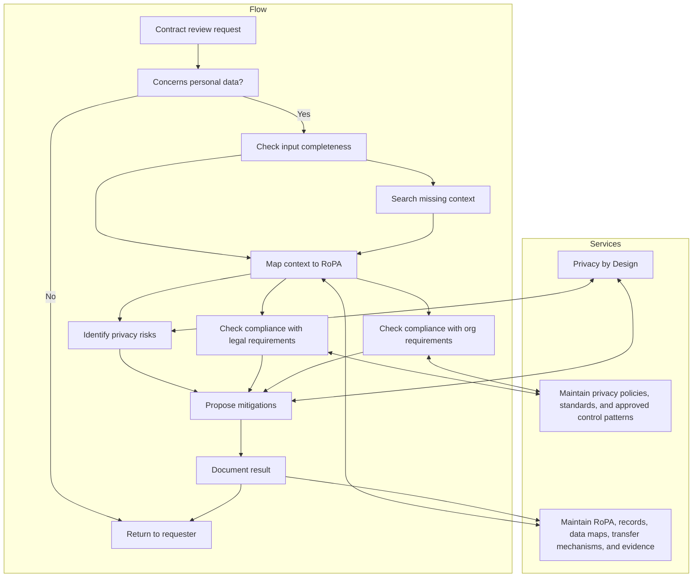

# Review a vendor, partner, or data-sharing arrangement

- Description: Reviews an external relationship or disclosure arrangement, linking the counterparty, role, flows, transfer mechanism, and due diligence expectations.
- When to use:
  - Procurement or a business owner wants to onboard, renew, or materially change a vendor or partner.
  - Personal data will be disclosed externally or accessed by another party.
  - Cross-border transfer or contractual role questions need privacy review.
  - No influence if the counterparty is a group member, review still required. 
- When not to use:
  - No external party or disclosure is involved.
  - Does not concern personal data.

## Inputs

- Counterparty identity, role, and business purpose for the arrangement.
- Description of the services provided or the data-sharing use case.
- Files and/or links to documentation.

## Outputs

- Review outcome.
- Required contract terms, controls, or remediation conditions.

## Process description

Steps:
1. Does the matter concern personal data? Proceed if positive, otherwise, finish with an outcome: No review required
2. Check if you have a clear understanding of the following: 
   1. File / link to be reviewed
   2. Purpose of engagement
   3. Business unit indication
   4. Our role in the contract (e.g. service provider or client)
   5. (Optionally) Additional comments
3. Identify full context:
   1. Status Quo. Research existing materials
      1. Provided by the user, including the goal and the documents provided
      2. Available in processingActivity.csv (schema available in processingActivity.yaml)
      3. Available on the Internet regarding the counterparty and generally the goal of processing
   2. Delta. How does the contractual document intend to deviate and/or change the existing context
4. Check legal compliance
   1. Processing Role. Based on (1) the contract; and (2) your understanding of Article 28 and generally GDPR; assess if the counterparty should be a controller, processor or joint controller. Compare your result to the text of the contract.
   2. Based on result of previous step, assess the compliance of the contract to legal requirements (available in legalRequirements.csv, schema in legalRequirements.yaml)
   3. Assess if the contract is sufficiently detailed to describe the types of data processed as well as data subject categories
5. Check for organizational requirements. Find relevant items in organizationRequirements.csv.
6. Perform a privacy risk assessment
   1. Identify privacy risks based on taxonomy in privacyRiskTaxonomy.csv and record the selected taxonomy items on the privacy risk entry
   2. Assess the likelihood and impact on a 1-5 scale, calculate total risk score
   3. In case the risk score is 15 or above, propose mitigation efforts to resolve such risks.
7. Propose
   1. Mitigations. For each legal, organizational and privacy risks, propose mitigation actions. Categorize the mitigations into (1) contractual (amendments to contract); and (2) internal (efforts which we should implement internally as they cannot be closed by contractual controls)
   2. Residual risk action. Regarding acceptable risks, list those risks.
8. Create in relevant data source a new / updated entry for 
   1. ThirdPartyEngagement
   2. ProcessingActivity
   3. Assessment
   4. DataFlow
   5. Party
   6. TransferMechanism
9.  Return the required outputs to the user.
